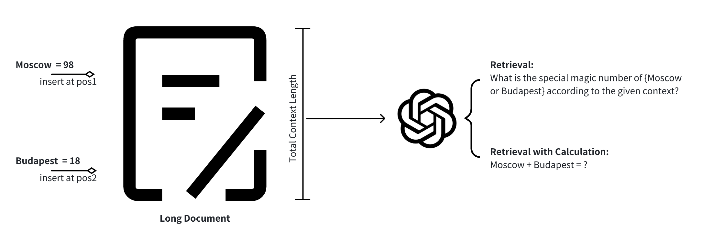
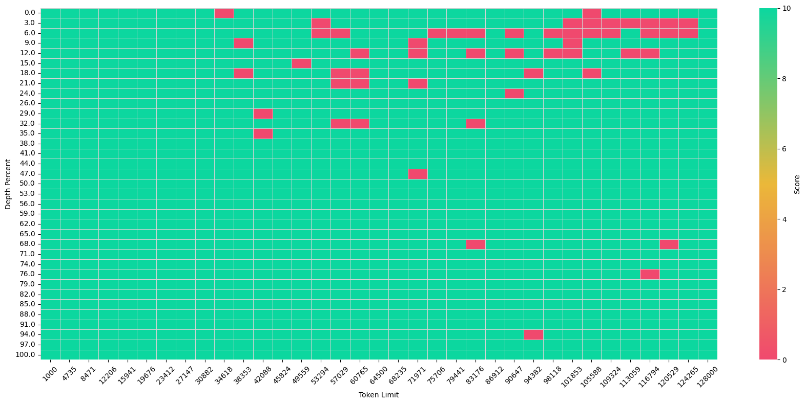
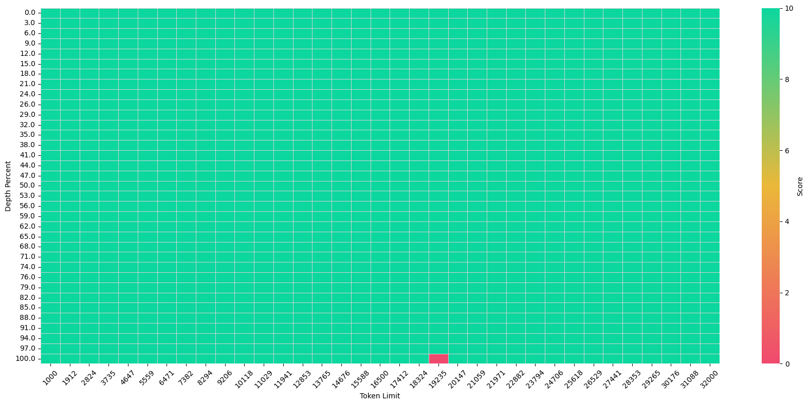
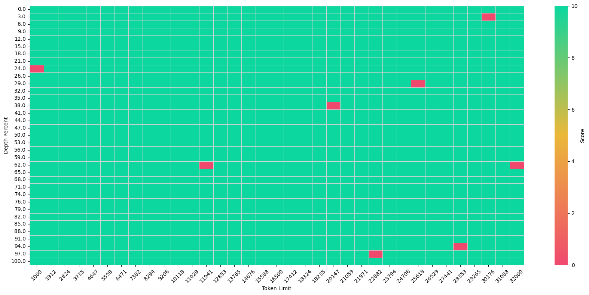
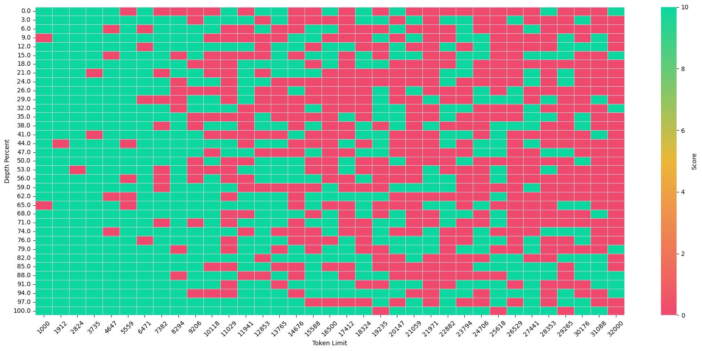
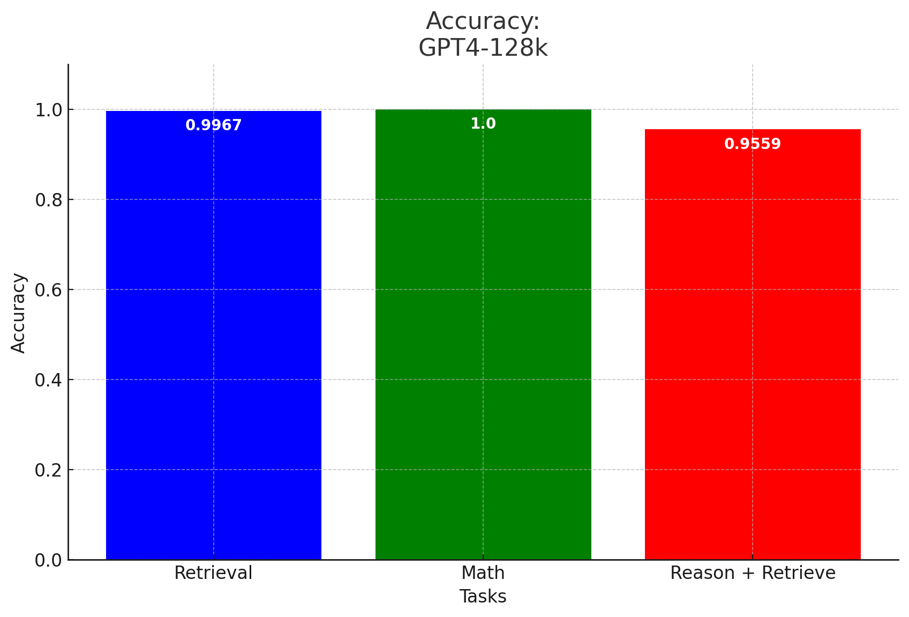
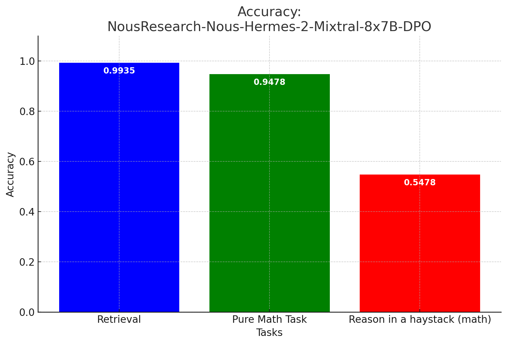

## Reason in a haystack: understanding model’s behavior under long context reasoning
<div align=center>

</div>

An extended version of Needle In a Haystack by [Greg Kamradt](https://github.com/gkamradt) to test the abilities that LLM conduct retrieve and reasoning at the same time. A more challenge and pratical task.

## Getting Started
1. **Set up environment**
```shell
pip install requirement.txt
```

2. **Config parameters under config/**
```python
openai_api_key = "YOUR KEY HERE"
or
anthropic_api_key = None,
zhipu_api_key = None,
model_provider = "OpenAI", # or "zhipu" or "Anthropic" or "HF-chat" or "HF-instruct"
model_name='gpt-4-turbo-preview',
url = "your api endpoint",

n_needles_total = 2, # how many needle spread in the doc, for reasoning +  retrieval please set to 2 and for tradition  needle in a haystack, signle number retrieval, please set to 1
needles_dis = 1000, # control the distance bewteen two needles, only activate when param:inject set to 'range'
save_prefix = "" # results save location pre_fix, default results/
inject = "" # empty or range, if empty, all needle will be concat together
mode = "math" # math or normal, conduct number retrieval or calculation
num_concurrent_requests = 3 # do set too large otherwise you will be rate limit
```

**Examples:**

a. If you want to test retrieve with calculation under concat(dis =0), set `n_needles_total = 2, inject = "",  mode = "math"`

b. If you want to test retrieve only, set `n_needles_total = 1, inject = "",  mode = "normal"`

3. **After you set the params:** 
```shell
python run.py --config /path/to/config.yaml
```

## Preliminary results

<div align=center>

### GPT4-128K ([gpt-4-turbo-preview](https://platform.openai.com/docs/models))


<table>
  <tr>
    <td>
      
    </td>
    <td>
      
    </td>
  </tr>
  <tr>
    <td>
      <p align="center">Retrieval</p>
    </td>
    <td>
      <p align="center">Retrieval + Calculation</p>
    </td>
  </tr>
</table>


<!-- **Retrieval**


**Retrieval + Calculation** -->


### GPT4-32K ([gpt-4-turbo-preview](https://platform.openai.com/docs/models))

<table>
  <tr>
    <td>
      
    </td>
    <td>
      
    </td>
  </tr>
  <tr>
    <td>
      <p align="center">Retrieval</p>
    </td>
    <td>
      <p align="center">Retrieval + Calculation</p>
    </td>
  </tr>
</table>


<!-- **Retrieval**


**Retrieval + Calculation** -->


### [NousResearch-Nous-Hermes-2-Mixtral-8x7B-DPO-32K](https://huggingface.co/NousResearch/Nous-Hermes-2-Mixtral-8x7B-DPO)


<table>
  <tr>
    <td>
      
    </td>
    <td>
      
    </td>
  </tr>
  <tr>
    <td>
      <p align="center">Retrieval</p>
    </td>
    <td>
      <p align="center">Retrieval + Calculation</p>
    </td>
  </tr>
</table>

<!-- **Retrieval**


**Retrieval + Calculation** -->
### Accuracy breakdown on retrieval; math and retrieval with calculation

<table>
  <tr>
    <td>
      
    </td>
    <td>
      
    </td>
  </tr>
  <tr>
    <td>
      <p align="center">Accuracy breakdown of GPT4</p>
    </td>
    <td>
      <p align="center">Accuracy breakdown of Mistral 8*7B</p>
    </td>
  </tr>
</table>


<!-- **Accuracy**


**Accuracy** -->


</div>

## Acknowledgement
Our code are built on top of [LLMTest_NeedleInAHaystack](https://github.com/gkamradt/LLMTest_NeedleInAHaystack) and [Large World Model](https://github.com/LargeWorldModel/LWM) project. Thanks!